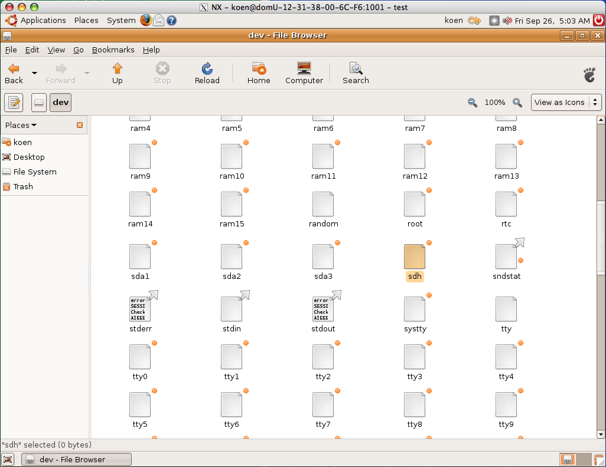

+++
date = "2008-09-26"
title = "Snapshots of EBS Volumes"
slug = "snapshots-of-ebs-volumes"
author = "Koen"
+++

Continuing with the volume created in the post 
[Sharing EBS Volumes Among Instances](/2008/09/sharing-ebs-volumes-among-instances/), in this post I show 
how to create a snapshot, create a new volume from that snapshot, and mount the new volume in an instance. 
Remember that the volume created in the previous post contained 1 file called `readme`.

<!--more-->

### Creating the Snapshot

First we look at the available volumes:



Then we make the snapshot:



It is `pending`. We check the status until it the snapshot creation has `completed`:



### Creating a Volume from the Snapshot

Now that the snapshot is ready, we can create a new volume from it. Note that we create it in a different 
availability zone. The orginal volume resides in `us-east-1c`. The new volume will reside in `us-east-1a`.



We wait until the volume is `available`:



Now we have two available volumes.

### Mounting the New Volume in an Instance

Let's launch an image so that we can verify that the newly created volume can be mounted and has the same contents 
as the original volume. Note that the instance is launched in the availability zone where the newly created volume 
resides.



The AMI we use here is a public Ubuntu Desktop image.



The instance is ready to be used. In another terminal we connect to the image and start the `user-setup` script. 
The GUI interaction to set up the user is not shown here.



Time to attach the volume (in the orginal terminal):



Let's see whether it is available. Connect to the desktop as described in 
[Preparing for Amazon AWS Usage](/2008/09/preparing-for-amazon-aws-usage/).

In the terminal connected to the instance, we can mount the volume now:



Now the volume should be mounted as `my-volume` and accessible. Let's verify that by opening a file browser on 
that volume.

Indeed, the `readme` file that was on the original volume is also on the new volume created from the snapshot.
